# Sendra Labs

Sendra Labs is a modular, Arbitrum-native DeFi infrastructure that combines execution, analytics, and strategy-level accounting into a single operational layer. We are building the platform where liquidity learns, strategies execute, and DeFi evolves.

## Architecture Overview

Sendra Labs is structured around four interoperable layers: Intelligence, Execution, Accounting, and Social. Each built as an independent module but designed to work together seamlessly.

```mermaid
graph TB
    subgraph Layers["LAYERS"]
        direction TB
        
        subgraph Intelligence["Intelligence Layer"]
            INT_DESC["Real-time analytics and decision system<br/>Aggregates on-chain and off-chain data<br/>Filters noise, detects patterns<br/>Generates actionable insights"]
            INT_INPUT["On-Chain & Off-Chain Data Inputs<br/>(Historical Metrics, Market Behavior)"]
            INT_INPUT --> INT_DESC
        end
        
        subgraph Execution["Execution Layer"]
            EXE_DESC["On-chain abstraction and orchestration layer<br/>Reduces UX friction<br/>Performs complex calculations<br/>Executes strategies in a single transaction"]
            EXE_FUNC["Abstracts complexity:<br/>DeFi strategies in one click"]
            EXE_FUNC --> EXE_DESC
        end
        
        subgraph Accounting["Accounting Layer"]
            ACC_DESC["Strategy-level DeFi ledger system<br/>Records actions, positions, and outcomes<br/>Structured and extensible format<br/>Supports any strategy type"]
            ACC_FUNC["Transforms DeFi actions into structured data.<br/>Strategy-Level Accounting"]
            ACC_FUNC --> ACC_DESC
        end
        
        subgraph Social["Social Layer"]
            SOC_DESC["Collaborative and analytical DeFi coordination<br/>Enables learning from aggregated behavior<br/>Preserves privacy<br/>On-chain discovery and reputation"]
            SOC_FUNC["On-Chain Discovery and Reputation"]
            SOC_FUNC --> SOC_DESC
        end
    end

    Core["Sendra Labs<br/>Core Platform"]

    Intelligence --> Core
    Execution --> Core
    Accounting --> Core
    Social --> Core

    style Layers fill:#1a1a1a,stroke:#fff,stroke-width:2px,color:#fff
    style Intelligence fill:#2d2d2d,stroke:#4a9eff,stroke-width:2px,color:#fff
    style Execution fill:#2d2d2d,stroke:#4a9eff,stroke-width:2px,color:#fff
    style Accounting fill:#2d2d2d,stroke:#4a9eff,stroke-width:2px,color:#fff
    style Social fill:#2d2d2d,stroke:#4a9eff,stroke-width:2px,color:#fff
    style Core fill:#0d47a1,stroke:#fff,stroke-width:3px,color:#fff
```

## Current Status

The MVP is fully deployed on Arbitrum mainnet with all core components operational.

https://github.com/user-attachments/assets/034ed789-718d-43e2-8eb1-23bba50e2f31

### Frontend
- **Stack**: React 19 + TypeScript, Wagmi 2.x + Viem for blockchain interactions
- **Real-time**: Lightweight Charts for live price tracking, TanStack Query for state management
- **RPC Resilience**: Robust fallback system with multiple RPC providers (Arbitrum official, Ankr, LlamaNodes) ensuring 99.9% uptime
- **GMX Integration**: Deep integration with 26 tokens combinable to create hundreds of trading pairs (325 possible combinations) running on Arbitrum's infrastructure
- **UX**: Users can execute institutional-grade pair trading strategies in just 3 clicks with full transparency and integrated PnL tracking

### Smart Contracts
- **Core Components**: Execution and Accounting layers deployed on Arbitrum mainnet
- **Pair Trading**: Fully functional pair trading strategies routing to GMX
- **Architecture**: Proxy-based system with reusable proxies that isolate positions for more precise accounting and better control. Since GMX aggregates positions by msg.sender and market, our proxies enable position isolation at the strategy level
- **Security**: Proxies act as firewalls against attacks, with strict access controls, Solidity best practices, and security patterns
- **GMX Integration**: Handles GMX asynchronicity with callbacks, position registration, and lifecycle management system
- **Design**: Modular architecture designed for unlimited scalability

### Backend
- **Intelligence API**: Deployed analytics API for the Intelligence layer
- **Pair Analysis**: Data-driven and statistically-backed pair trading analysis

## Links

- **Website**: [Production](https://sendralabs.com)
- **Twitter**: [@SendraLabs](https://twitter.com/SendraLabs)

## Beta Access

Sendra Labs is currently in controlled beta. To request access, please contact us via:

- **Email**: sendralabs.eth@gmail.com
- **Telegram**: [Join our community](https://t.me/sendralabs) (coming soon)
