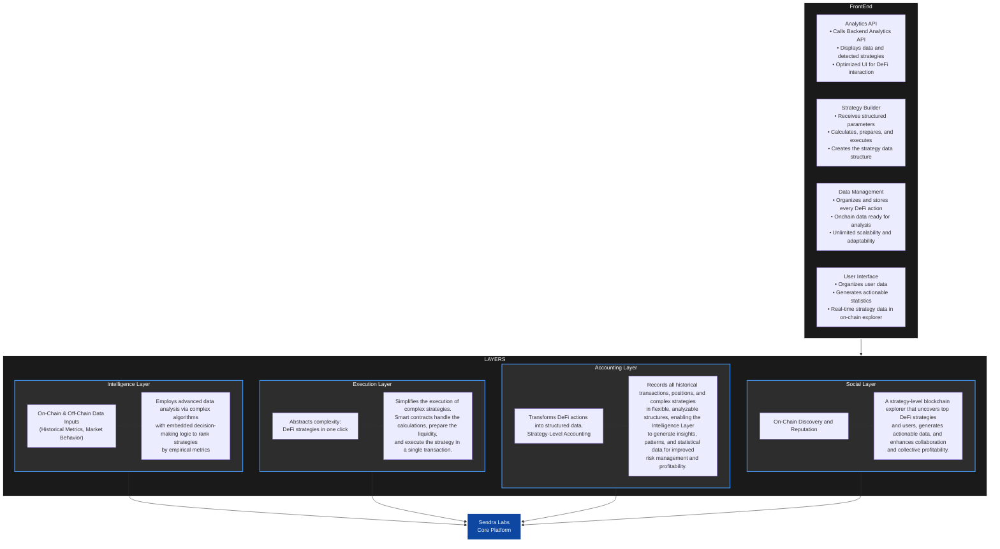

# Sendra Labs

Sendra Labs acts as an intelligent layer between users and DeFi protocols, focusing on data-driven decisions without promises of profitability or hype. We emphasize verifiable on-chain reputation and long-term strategy execution.

## Development Stats

## Key Features

| Feature            | Description                                      | Benefit                          |
|--------------------|--------------------------------------------------|----------------------------------|
| Advanced Analytics | Employs data-driven insights for strategy evaluation. | Informed decision-making.        |
| Strategy Execution | Simplifies complex DeFi interactions.            | Efficient operations.            |
| Position Accounting| Tracks and analyzes performance over time.       | Clear financial overview.        |
| Social Discovery   | Enables exploration of on-chain strategies and reputations. | Community-driven insights.       |

## Architecture Overview

Sendra Labs is built on a multi-layered architecture that processes, executes, accounts for, and presents DeFi strategies and data. The system flows from user interaction through intelligent processing layers to core execution.

### Architecture Components

#### FrontEnd Layer
The user-facing interface consists of four main components:

- **Analytics API Integration**: Connects to backend analytics, displays strategy data, and provides an optimized DeFi interaction interface
- **Strategy Builder**: Processes structured parameters, performs calculations, and creates executable strategy data structures
- **Data Management**: Organizes and stores all DeFi actions with on-chain data ready for analysis, designed for unlimited scalability
- **User Interface**: Manages user data, generates actionable statistics, and provides real-time strategy exploration

#### Core Layers

**1. Intelligence Layer**
- **Purpose**: Advanced data analysis using complex algorithms with embedded decision-making logic
- **Functionality**: Ranks strategies by empirical metrics based on historical performance and market behavior
- **Data Sources**: On-chain and off-chain data inputs including historical metrics and market behavior patterns

**2. Execution Layer**
- **Purpose**: Simplifies complex DeFi strategy execution
- **Functionality**: Smart contracts handle calculations, liquidity preparation, and strategy execution in a single transaction
- **Benefit**: Abstracts complexity, enabling DeFi strategies to be executed with one click

**3. Accounting Layer**
- **Purpose**: Comprehensive transaction and position tracking
- **Functionality**: Records all historical transactions, positions, and complex strategies in flexible, analyzable structures
- **Value**: Enables the Intelligence Layer to generate insights, patterns, and statistical data for improved risk management and profitability
- **Approach**: Strategy-level accounting that transforms DeFi actions into structured data

**4. Social Layer**
- **Purpose**: Strategy-level blockchain exploration and reputation system
- **Functionality**: Uncovers top DeFi strategies and users, generates actionable data
- **Benefit**: Enhances collaboration and collective profitability through on-chain discovery and reputation mechanisms

### System Flow

1. **User Interaction**: Users interact with the FrontEnd layer through the optimized UI
2. **Data Processing**: FrontEnd components process requests and prepare data structures
3. **Layer Processing**: The four core layers (Intelligence, Execution, Accounting, Social) process and enhance the data
4. **Core Integration**: All layers feed into the Sendra Labs core platform
5. **Output**: Processed strategies, analytics, and insights are returned to users through the FrontEnd
