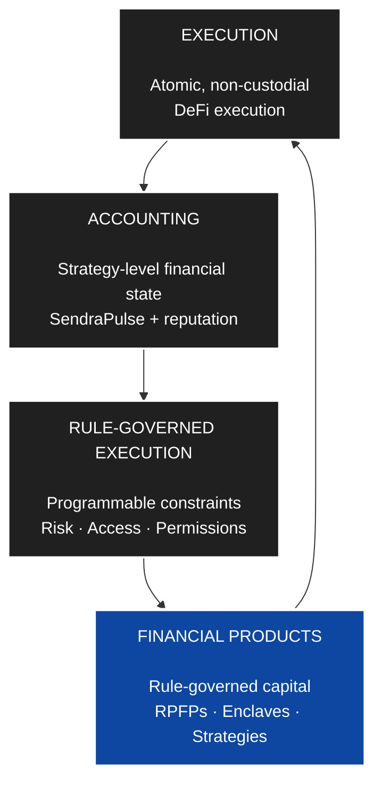

# Sendra Labs

Sendra Labs is building **programmable financial infrastructure for DeFi**.

Sendra combines **non-custodial execution, strategy-level accounting, and programmable financial constraints** into an operational layer where capital can move according to verifiable rules rather than trust.

Built natively on Arbitrum.

---

## What is Sendra?

DeFi can execute financial operations trustlessly, but sophisticated capital allocation still relies heavily on intermediaries, opaque strategies, or excessive collateral.

Sendra provides the infrastructure to bridge that gap.

The protocol turns DeFi activity into structured financial state and allows that state to be consumed by programmable execution environments.

```mermaid
graph TB

    Execution["EXECUTION<br/><br/>Atomic, non-custodial<br/>DeFi execution"]

    Accounting["ACCOUNTING<br/><br/>Strategy-level financial state<br/>SendraPulse + reputation"]

    Rules["RULE-GOVERNED EXECUTION<br/><br/>Programmable constraints<br/>Risk · Access · Permissions"]

    Products["FINANCIAL PRODUCTS<br/><br/>Rule-governed capital<br/>RPFPs · Enclaves · Strategies"]

    Execution --> Accounting
    Accounting --> Rules
    Rules --> Products
    Products --> Execution

    style Execution fill:#202020,stroke:#ffffff,stroke-width:2px,color:#ffffff
    style Accounting fill:#202020,stroke:#ffffff,stroke-width:2px,color:#ffffff
    style Rules fill:#202020,stroke:#ffffff,stroke-width:2px,color:#ffffff
    style Products fill:#0d47a1,stroke:#ffffff,stroke-width:3px,color:#ffffff
```

### Execution

Sendra provides atomic execution across DeFi protocols while keeping capital non-custodial.

Execution contracts abstract complex operations into controlled, composable flows while maintaining isolated positions and transparent on-chain state.

Current integrations include **Uniswap and GMX**, with the architecture designed to support additional protocols and strategy types.

### Accounting

Sendra's accounting layer is more than transaction history.

It maintains **strategy-level financial state** through structured accumulators and position records, allowing protocol activity to be represented in a standardized and composable format.

The system tracks information such as:

* Capital inflows and outflows
* Realized PnL
* Profit and loss events
* Exposure
* Position lifecycle
* Strategy-specific metrics
* Historical performance

At its core is **SendraPulse**, which aggregates user and strategy-level financial state into a format that can be consumed by other protocol components.

This accounting substrate is the foundation for verifiable on-chain reputation and programmable financial logic.

### Rule-Governed Execution

The next layer of Sendra allows financial operations to be executed under programmable constraints.

Rules can define:

* Who can access capital
* Which protocols and assets can be used
* Position and exposure limits
* Drawdown and loss limits
* Execution permissions
* Temporal restrictions
* Settlement conditions
* Capital-provider controls

Instead of relying on an intermediary to enforce these conditions, the execution environment enforces them programmatically.

---

## Rule-Programmable Finance

Sendra is designed around a simple progression:

**Execution → Accounting → Reputation → Programmable Capital**

The accounting layer creates a standardized representation of real DeFi performance.

That information can then be used by rule-governed execution environments to determine who can access capital and what they are allowed to do with it.

This creates the foundation for financial products such as:

* On-chain capital allocation
* Skill-based funding
* Rule-governed trading environments
* Strategy financing
* Structured DeFi products
* Reputation-gated financial services
* Automated risk-controlled strategies

The goal is not to build another DeFi dashboard.

**The goal is to make capital programmable.**

---

## RPFPs — Rule-Programmable Financial Products

Sendra's infrastructure is designed to support **Rule-Programmable Financial Products (RPFPs)**.

An RPFP defines how capital is supplied, used, controlled and settled through smart-contract-enforced rules.

Each product can specify its own:

* Protocols
* Assets
* Positions
* Risk parameters
* Permissions
* Capital-provider rights
* Settlement logic
* Performance conditions

The first RPFP implementations are being developed around **Enclave-style environments**, where capital providers and operators interact under predefined execution constraints.

### LP Credit Enclaves

The first major RPFP implementation is the **LP Credit Enclave**.

LP Credit Enclaves allow capital providers to fund liquidity operators while keeping the capital inside a programmatically controlled execution environment.

The enclave defines the rules governing the relationship between capital and execution, while Sendra's accounting infrastructure records the resulting financial activity.

This provides a concrete implementation of Sendra's broader programmable-capital architecture.

---

## Current Architecture

Sendra is modular by design.

### Core Infrastructure

**Execution**

Atomic, non-custodial execution across integrated DeFi protocols.

**Accounting**

Strategy-level financial records and SendraPulse accumulators providing structured on-chain financial state.

**Programmable Execution**

Rule-governed execution environments that constrain how capital can be used.

**Financial Products**

RPFPs and Enclaves built on top of the underlying execution and accounting primitives.

### Experimental Layer

**Sendra Labs** is also used to explore applications and research built around the infrastructure.

Current and experimental work includes:

* Pair-trading analytics
* Hyperliquid market and trader analysis
* Strategy discovery
* Risk and performance analytics
* Experimental DeFi strategies

These experiments help validate ideas, data models and financial primitives without defining the core protocol itself.

---

## Current Status

Sendra's core infrastructure is deployed on **Arbitrum Mainnet** and has been validated through controlled real-world execution.

The protocol has progressed from the initial data-bootstrap phase into the development of its rule-governed financial infrastructure.

Current work focuses on:

* Hardening the execution infrastructure
* Expanding the accounting and SendraPulse system
* Developing rule-governed execution
* Building and testing RPFPs
* Developing Enclave-based capital allocation
* Preparing the infrastructure for broader beta usage
* Improving security and audit readiness

The protocol is being developed incrementally, with controlled deployments and testing before wider public access.

---

## Design Principles

### Non-Custodial

Sendra does not require users to transfer custody of their capital to the protocol.

### Programmable

Financial constraints are represented as explicit smart-contract logic rather than relying on human intermediaries.

### Modular

Execution, accounting, rules and financial products are separated into composable components.

### Strategy-Level Accounting

DeFi activity is represented as financial strategies and positions rather than isolated transactions.

### Verifiable Reputation

Performance and behavior can become part of an on-chain financial record rather than an off-chain claim.

### Composable

The infrastructure is designed to support additional protocols, strategies and third-party financial products without rebuilding the underlying accounting and execution primitives.

---

## Roadmap

### Phase I — Data & Execution Foundation

Build the execution and accounting substrate.

* Atomic DeFi execution
* Strategy-level accounting
* SendraPulse
* Position tracking
* Initial protocol integrations
* Analytics infrastructure

### Phase II — Programmable Finance

Turn the accounting substrate into programmable financial infrastructure.

* Rule-governed execution
* Reputation-aware access
* Risk constraints
* Capital-provider controls
* RPFP infrastructure
* Enclave-based products

### Phase III — Financial Network

Extend the infrastructure into a broader network connecting:

**Capital · Operators · Strategies · Reputation**

The objective is to enable capital to discover and interact with proven financial activity through programmable financial environments.

### Beyond

Open the infrastructure to third-party builders and allow new financial products to be deployed on top of Sendra's execution, accounting and rule primitives.

---

## Why Arbitrum?

Sendra is designed as an **Arbitrum-native financial infrastructure layer**.

The protocol routes execution and liquidity through Arbitrum DeFi while creating standardized financial state that can be consumed by applications and financial products built on top of it.

The long-term objective is to make Arbitrum a stronger environment for sophisticated, programmable capital allocation.

---

## Links

* **Website:** https://sendralabs.com
* **GitHub:** https://github.com/Sendra-labs

---

## Development

Sendra Labs is currently under active development.

The protocol is being developed through controlled deployments and iterative validation before broader production access.

For technical collaboration, infrastructure integrations or ecosystem discussions, reach out through the project channels.
